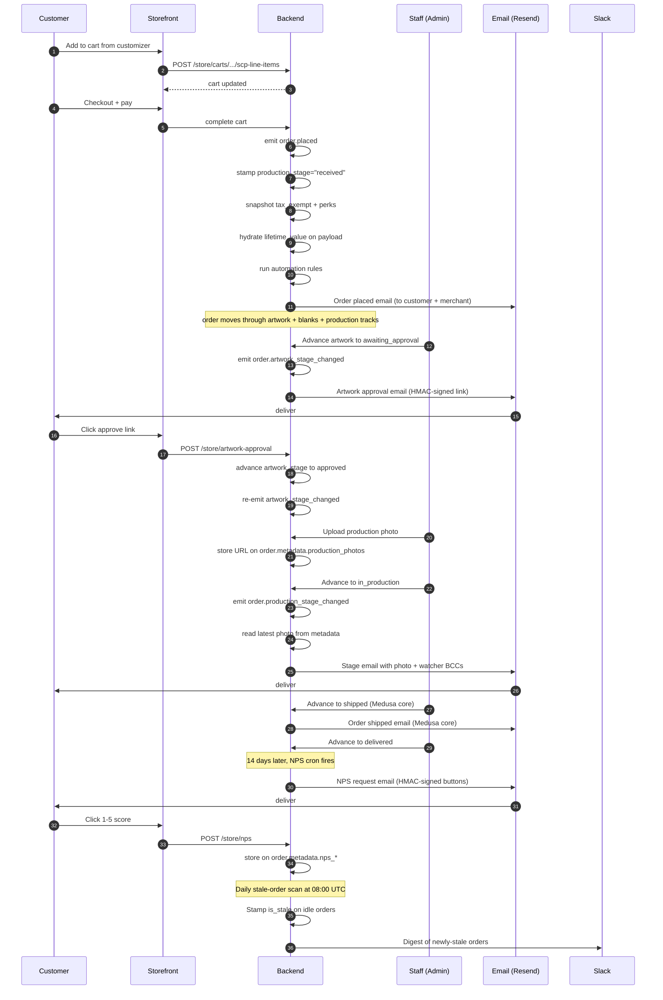
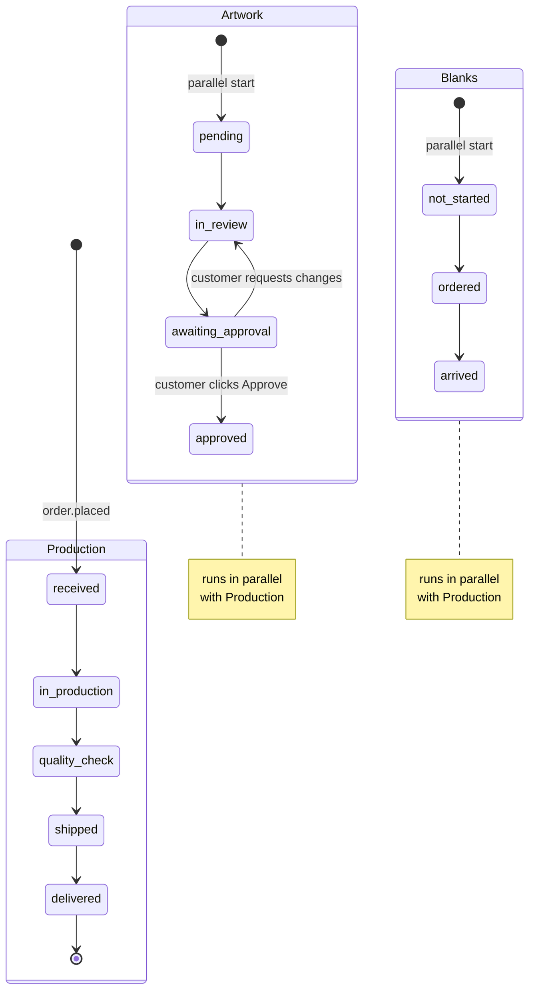
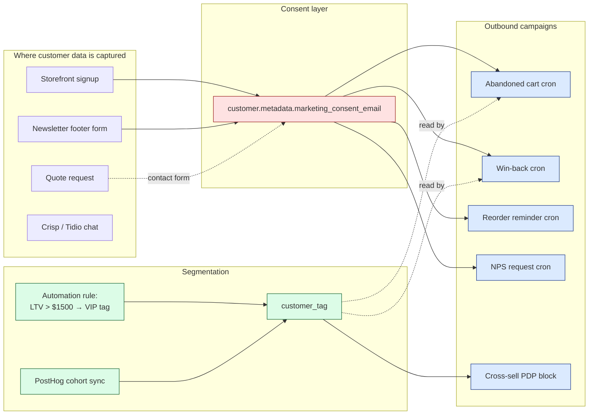
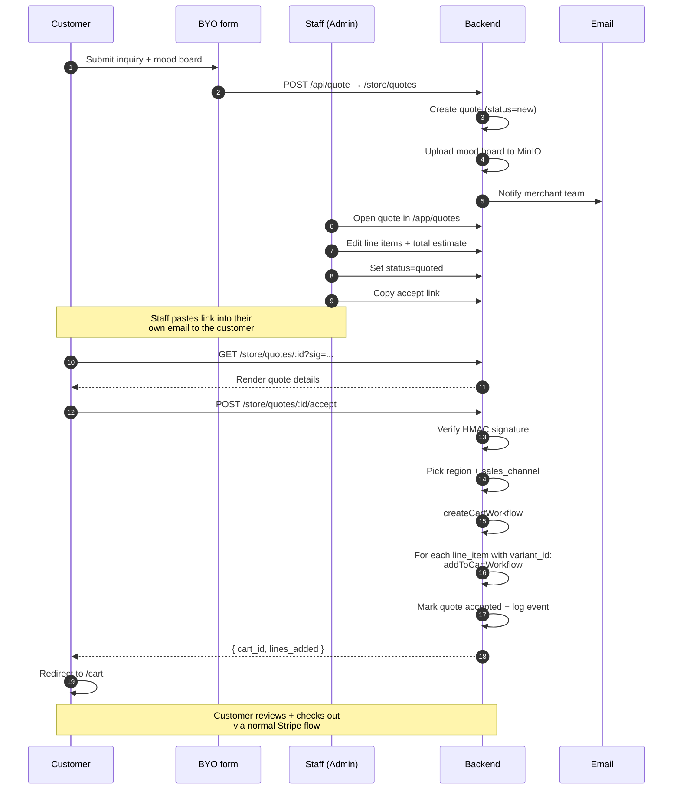
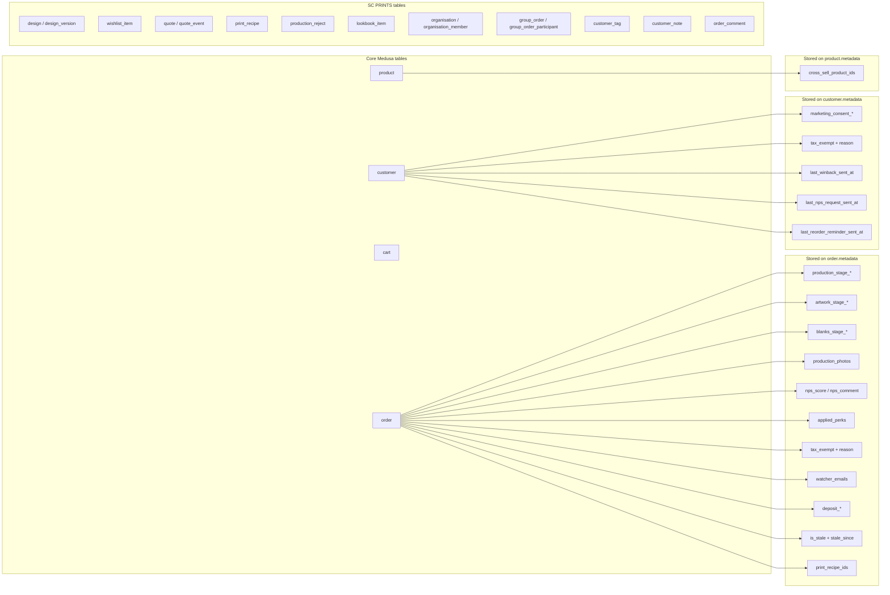

# SC PRINTS backend flow map

How information moves through the platform — from customer-facing trigger to internal artefacts.

Pairs with [`STAFF_GUIDE.md`](./STAFF_GUIDE.md) (the "what should I click?" view).

Diagrams use Mermaid — they render natively on GitHub, in most IDEs (VS Code with Markdown Mermaid extension), and on `mermaid.live`.

---

## The big picture

```mermaid
flowchart TB
    subgraph CUST["Customer touchpoints"]
        STORE[Storefront catalog]
        CUSTOMIZER[Fabric.js customizer]
        ACCOUNT[/account dashboard]
        BYO[BYO inquiry form]
        EMAIL_REPLY[Reply to email]
    end

    subgraph CORE["Medusa core"]
        CART[(Cart)]
        ORDER[(Order)]
        CUSTOMER[(Customer)]
        PRODUCT[(Product)]
    end

    subgraph CUSTOM["SC PRINTS modules"]
        DESIGN[(Design + design_version)]
        WISHLIST[(Wishlist)]
        QUOTE[(Quote + events)]
        RECIPE[(Print recipe)]
        REJECT[(Production reject)]
        LOOKBOOK[(Lookbook)]
        ORG[(Organisation + members)]
        GROUP[(Group order + participants)]
        WORKSPACE[(customer_tag + customer_note + order_comment)]
    end

    subgraph EVENTS["Event bus"]
        EV_PLACED[order.placed]
        EV_STAGE[order.production_stage_changed]
        EV_ART[order.artwork_stage_changed]
        EV_CREATED[customer.created]
    end

    subgraph SUBS["Subscribers"]
        SUB_EMAIL[Email sender]
        SUB_AUTO[Automation rule engine]
        SUB_PERKS[Snapshot perks + tax_exempt]
        SUB_STAGE_STAMP[Stamp initial stage]
        SUB_PHOTO[Attach latest photo]
    end

    subgraph CRONS["Daily / weekly crons"]
        CRON_CART[Abandoned cart]
        CRON_WB[Win-back]
        CRON_NPS[NPS request]
        CRON_REORDER[Reorder reminders]
        CRON_STALE[Stale order scan]
        CRON_CROSS[Cross-sell refresh]
        CRON_PH[PostHog cohort sync]
        CRON_INV[Supplier inventory]
        CRON_SEO[SEO analytics]
    end

    subgraph OUT["Outbound channels"]
        RESEND[Resend email]
        SLACK[Slack webhook]
        POSTHOG[PostHog analytics]
        GA4[Google Analytics 4]
        SHIPSTATION[ShipStation]
        STRIPE[Stripe]
    end

    subgraph ADMIN["Admin"]
        STUDIO[Studio dashboard]
        ORDER_PAGE[Order detail widgets]
        CUSTOMER_PAGE[Customer detail widgets]
        REPORTS[Reports]
        GANTT[Production calendar]
        QUOTE_PAGE[Quote pipeline]
    end

    STORE --> CART
    CUSTOMIZER --> CART
    CART --> ORDER
    BYO --> QUOTE
    ACCOUNT -.reads.-> ORDER
    ACCOUNT -.reads.-> DESIGN
    ACCOUNT -.reads.-> WISHLIST

    ORDER --> EV_PLACED
    EV_PLACED --> SUB_EMAIL
    EV_PLACED --> SUB_AUTO
    EV_PLACED --> SUB_PERKS
    EV_PLACED --> SUB_STAGE_STAMP

    ORDER --> EV_STAGE
    EV_STAGE --> SUB_EMAIL
    EV_STAGE --> SUB_PHOTO

    CUSTOMER --> EV_CREATED
    EV_CREATED --> SUB_AUTO

    SUB_EMAIL --> RESEND
    SUB_AUTO --> WORKSPACE
    SUB_AUTO --> ORDER
    SUB_PERKS --> ORDER
    SUB_STAGE_STAMP --> ORDER

    CRON_CART --> RESEND
    CRON_WB --> RESEND
    CRON_NPS --> RESEND
    CRON_REORDER --> RESEND
    CRON_STALE --> ORDER
    CRON_STALE --> SLACK
    CRON_CROSS --> PRODUCT
    CRON_PH --> WORKSPACE

    CUSTOMIZER -.identify+events.-> POSTHOG
    STORE -.pageview+ecom.-> GA4
    STORE -.pageview+ecom.-> POSTHOG

    EMAIL_REPLY -.inbox+ord alias.-> WORKSPACE

    STUDIO -.reads.-> ORDER
    STUDIO -.reads.-> CUSTOMER
    STUDIO -.reads.-> QUOTE
    STUDIO -.reads.-> WORKSPACE
    ORDER_PAGE -.reads.-> ORDER
    ORDER_PAGE -.reads.-> RECIPE
    ORDER_PAGE -.reads.-> REJECT
    CUSTOMER_PAGE -.reads.-> POSTHOG
    REPORTS -.reads.-> ORDER

    classDef ext fill:#fef3c7,stroke:#92400e;
    classDef cron fill:#dbeafe,stroke:#1e40af;
    classDef sub fill:#e0e7ff,stroke:#3730a3;
    class RESEND,SLACK,POSTHOG,GA4,SHIPSTATION,STRIPE ext;
    class CRON_CART,CRON_WB,CRON_NPS,CRON_REORDER,CRON_STALE,CRON_CROSS,CRON_PH,CRON_INV,CRON_SEO cron;
    class SUB_EMAIL,SUB_AUTO,SUB_PERKS,SUB_STAGE_STAMP,SUB_PHOTO sub;
```

**How to read it:**
- **Yellow** = external service (Resend, Slack, PostHog, etc.).
- **Blue** = cron job (runs on a schedule).
- **Indigo** = subscriber (runs in response to an event).
- Solid arrows = primary data flow.
- Dotted arrows = "reads from" or "captures into" (no write to the source).

---

## Order lifecycle (the spine)



---

## The production-stage state machine



The three tracks run in parallel; nothing is hard-gated. Customer sees one "Preparing" milestone collapsing artwork + blanks; the production-stage tracker on `/account/orders/details/<id>` shows the two mini-tracks side by side.

Emails fire only on specific transitions (`STAGES_THAT_EMAIL` in `backend/src/lib/production-stage.ts`). Rollbacks don't re-send.

---

## How customer marketing data flows



**Consent gates every marketing send.** If a customer's `marketing_consent_email` is explicitly `false`, none of the four crons (abandoned, win-back, reorder, NPS) will email them. Tags are still applied — they just don't trigger automated outreach.

---

## Quote → cart conversion flow



---

## What writes where (data ownership map)



**Rule of thumb when adding new state:**
- "Read in many places, written in many places, queried for reports" → new table.
- "Read in one or two places, snapshot of a moment in time" → metadata on order / customer / product.

---

## External services touched

| Service | Purpose | Auth | Where configured |
| --- | --- | --- | --- |
| **Resend** | All outbound email | `RESEND_API_KEY` | `backend/src/lib/constants.ts` |
| **MinIO** | File storage (photos, mood boards, lookbook, customer originals) | `MINIO_*` | `backend/src/lib/constants.ts` |
| **PostHog** | Analytics + cohort sync + LLM tracking | `POSTHOG_*` | env vars; SDK in `storefront/src/lib/posthog.ts` |
| **GA4** | E-commerce funnel tracking | `NEXT_PUBLIC_GA_MEASUREMENT_ID` | `storefront/src/lib/analytics.ts` |
| **Stripe** | Card payments | `STRIPE_API_KEY` + webhook secret | Medusa payment provider |
| **PayPal** | Card alternative | `PAYPAL_*` | Medusa payment provider |
| **ShipStation** | Shipping label rates + tracking | `SHIPSTATION_*` | `backend/src/api/hooks/shipstation/` |
| **AS Colour API** | Supplier garment catalog + inventory | `ASCOLOUR_*` | `backend/src/modules/ascolour/` |
| **FashionBiz API** | Supplier garment catalog + inventory | `FASHIONBIZ_*` | `backend/src/modules/fashionbiz/` |
| **Google Search Console + GA4 admin** | SEO reporting | `GOOGLE_SERVICE_ACCOUNT_JSON` | `backend/src/services/seo-analytics/` |
| **Crisp / Tidio** | Live chat | `NEXT_PUBLIC_CRISP_WEBSITE_ID` or `NEXT_PUBLIC_TIDIO_PUBLIC_KEY` | storefront layout |
| **Slack** (optional) | Production-floor alerts | `SLACK_PRODUCTION_WEBHOOK_URL` | `backend/src/services/stale-orders/scan.ts` |
| **Postmark / SendGrid / Resend inbound** (optional) | Customer email replies → order comments | `ORDER_INBOX_DOMAIN` + `INBOUND_EMAIL_SECRET` + DNS MX | `backend/src/api/hooks/inbound-email/` |
| **Meilisearch** | Catalog search | `MEILISEARCH_HOST` | Medusa search plugin |

---

## Cron schedule cheatsheet (all UTC)

```mermaid
gantt
    title Daily cron schedule (UTC)
    dateFormat HH:mm
    axisFormat %H:%M

    section Inventory + analytics
    AS Colour inventory (hourly)   :00:00, 1h
    Cross-sell refresh             :02:00, 30m
    PostHog cohort sync            :03:30, 30m
    FashionBiz inventory           :04:00, 30m
    SEO analytics                  :05:00, 30m

    section Production
    Stale-order scan               :08:00, 15m

    section Marketing
    NPS request                    :22:00, 30m
    Abandoned-cart reminder        :23:15, 30m
    Reorder reminder               :23:30, 30m
    Report alerts                  :23:45, 15m
```



Weekly: win-back fires Mondays 00:00 UTC. Monthly: report digest fires the 2nd at 22:00 UTC.

Every cron is gated by an `*_ENABLED=true` env var so dev / staging stays quiet by default.

---

## Where things live in the codebase

Quick lookup for "I want to read / change the code for…":

| Feature | File / directory |
| --- | --- |
| Production stage list + emails | `backend/src/lib/production-stage.ts` |
| Stage-changed subscriber | `backend/src/subscribers/order-production-stage-changed.ts` |
| Artwork approval flow | `backend/src/services/artwork-approval/` + `backend/src/api/store/artwork-approval/` |
| LTV computation | `backend/src/services/customer-ltv/compute-ltv.ts` |
| Studio aggregator | `backend/src/services/studio-dashboard/build.ts` |
| Quote → cart conversion | `backend/src/api/store/quotes/[id]/accept/route.ts` |
| Cross-sell recommendations | `backend/src/services/cross-sell-recommendations/` |
| Production ETA | `backend/src/services/production-eta/` |
| Stale-order scan | `backend/src/services/stale-orders/scan.ts` |
| Order timeline aggregator | `backend/src/services/order-timeline/build.ts` |
| Customer journey aggregator | `backend/src/services/customer-journey/build.ts` |
| Inbound email webhook | `backend/src/api/hooks/inbound-email/route.ts` |
| Tax invoice HTML | `backend/src/api/store/customers/me/orders/[id]/invoice/route.ts` |
| Email templates | `backend/src/modules/email-notifications/templates/` |
| Automation rule engine | `backend/src/services/automation-rules/evaluate.ts` |

---

## When you add a new feature, the checklist

1. **Does this state live across multiple read paths?** → new entity, not metadata.
2. **Does it need a migration?** → add to `backend/src/modules/<name>/migrations/` and Medusa auto-runs on boot.
3. **Does it fire an event?** → add a subscriber under `backend/src/subscribers/`.
4. **Does it need to react to a schedule?** → add to `backend/src/jobs/` and pick a free slot from the Gantt above.
5. **Is it gated for safety?** → add an `*_ENABLED=true` env var with `false` default.
6. **Does staff need to see / interact with it?** → admin widget at the right zone, or new route under `backend/src/admin/routes/`.
7. **Does the customer see it?** → storefront page + data lib under `storefront/src/lib/data/`.
8. **Does it produce a number worth tracking?** → emit a PostHog event with `getPostHog()?.capture(...)`.
9. **Should staff understand it without asking?** → add a `<HelpTooltip>` next to the heading explaining the *why* and the gotchas.

Following this checklist keeps every feature consistent with the patterns already in the codebase. Deviating is fine when there's a reason — just be deliberate.
